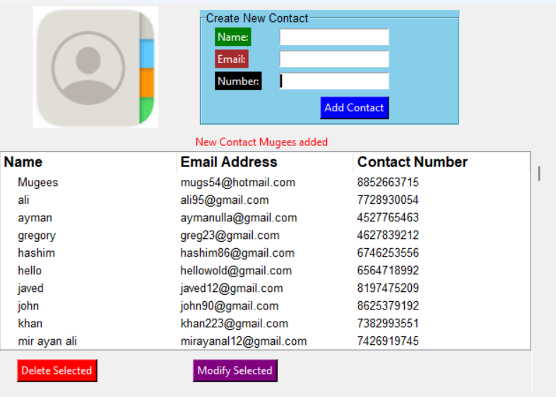

# Contact-Manager

Contact-Manager is a Python-based contact management application with a Tkinter GUI and SQLite database integration.

## Features

- Graphical User Interface (GUI) built with Tkinter.
- SQLite database for contact storage.
- CRUD operations: Create, Read, Update, and Delete contacts.
- Validation and error handling for data integrity.
- Modular architecture for code reusability and scalability.
- Real-time user feedback and notifications.
- Responsive design for cross-device compatibility.

## Installation

1. Clone the repository:
https://github.com/motassimkhan/Contact-Manager.git

2. Navigate to the project directory and install dependencies:
        cd contact-manager
        pip install -r requirements.txt

## Usage

1. Run the Contact-Manager application:
        python contact_manager.py

2. Perform contact management tasks using the GUI.

## User Interface

